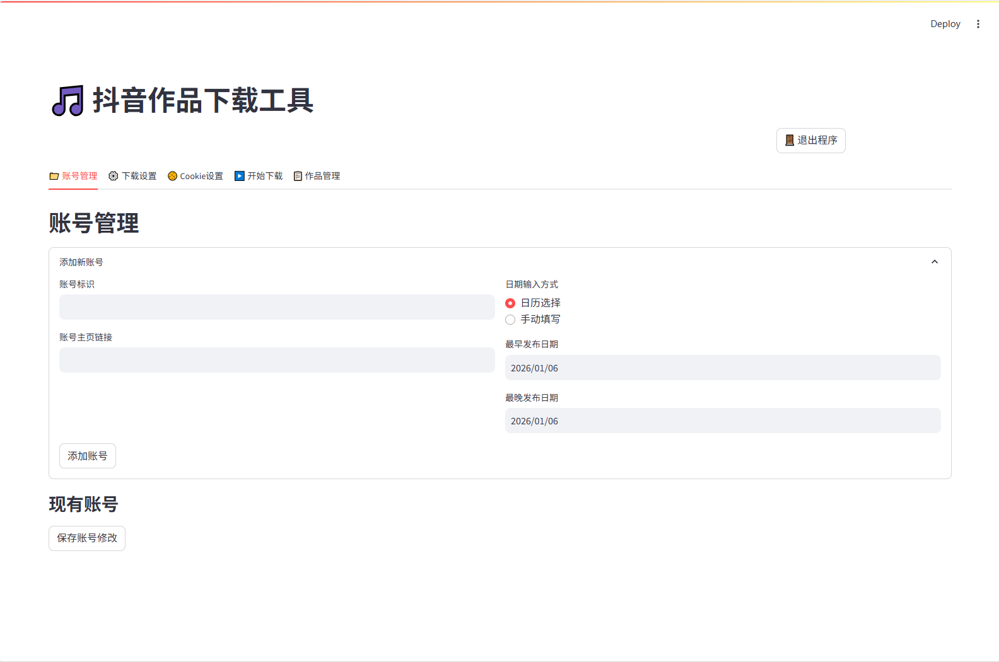
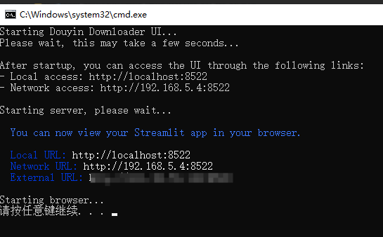
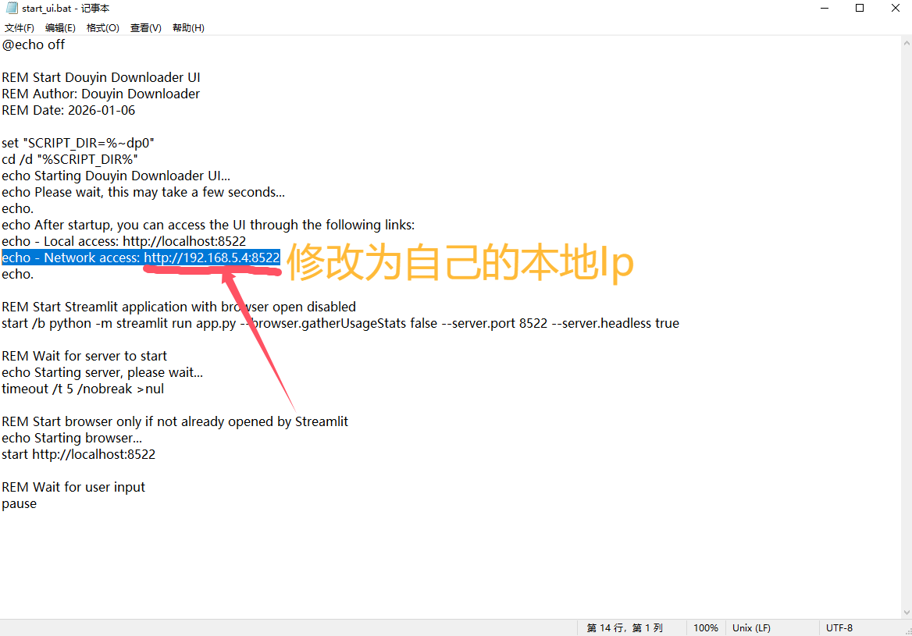
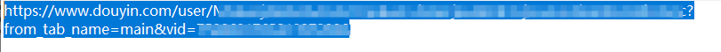
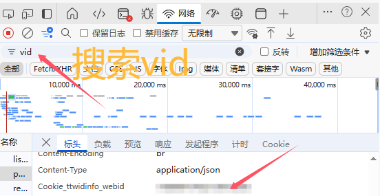
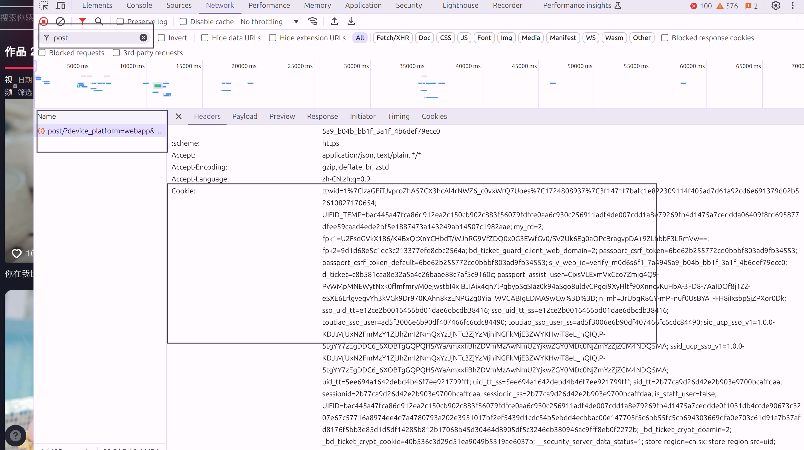

# DouYinDownload

## 项目介绍

本项目是基于GitHub大佬 [GuanDD123](https://github.com/GuanDD123) 的 [douyin_download](https://github.com/GuanDD123/douyin_download) 项目进行优化和扩展的抖音作品下载工具。

在原项目的基础上，我们添加了以下功能：
- 可视化UI界面，支持账号管理、Cookie管理、作品管理等功能
- 作品管理功能，支持读取现有账号的作品目录、勾选选择作品、下载选中的作品
- 自动跳转到网页端功能，打开脚本时自动打开浏览器
- 退出程序按钮，可在UI界面直接退出程序
- 网络连接优化，优先使用无代理连接，提高下载成功率
- 视频格式优化，强制使用.mp4扩展名，避免下载到.dash文件

## 项目功能

1. 使用协程下载视频与图集（协程数为 5）
2. 配置文件可设置是否下载视频、是否下载图集。
3. 使用配置文件连续下载多个帐号视频。
4. 可视化UI界面，支持账号管理、Cookie管理、作品管理等功能。
5. 作品管理功能，支持读取现有账号的作品目录、勾选选择作品、下载选中的作品。
6. 自动跳转到网页端功能，打开脚本时自动打开浏览器。
7. 退出程序按钮，可在UI界面直接退出程序。
8. 网络连接优化，优先使用无代理连接，提高下载成功率。
9. 视频格式优化，强制使用.mp4扩展名，避免下载到.dash文件。

### 运行截图







### 提示图片

- **复制cookie.png**：如何从浏览器复制抖音Cookie的示意图
- **运行截图1.png**：UI界面的账号管理和下载设置标签页截图
- **运行截图2.png**：UI界面的启动cmd窗口截图
- **运行截图3.png**：提示：若部署在本地服务端，请将下方出现的ip(运行截图3所示)替换为您实际的服务器 IP，例如 `http://your_server_ip:8522`
- **运行截图4.png**：电脑端抖音作者主页的链接格式
- **运行截图5.png**：vid获取方法

## 配置文件说明

### 配置文件优先级

程序运行时会按照以下优先级加载配置文件：
1. **settings_mine.json**：用户自定义配置文件（优先使用）
2. **settings_default.json**：默认配置文件（当 settings_mine.json 不存在时使用）

### 配置建议
- **首次配置**：复制 `settings_default.json` 为 `settings_mine.json`，然后在 `settings_mine.json` 中进行个性化配置
- **后续修改**：直接修改 `settings_mine.json` 文件，不会影响默认配置
- **恢复默认**：删除 `settings_mine.json` 文件，程序会自动使用 `settings_default.json`

### 必要参数

| 条目            | 说明                                                                                                 |
| --------------- | ---------------------------------------------------------------------------------------------------- |
| accounts        | 要下载的帐号信息，可添加多个帐号                                                                     |
| mark            | 账号标识，可以设置为空字符串                                                                         |
| url             | 账号主页链接（必须为电脑网页端链接）                                                                 |
| earliest        | 要下载的作品最早发布日期（默认为 2016/9/20）                                                         |
| latest          | 要下载的作品最晚发布日期（默认为 前一天日期）                                                        |

- **注意**：cookies 为必要参数，但不需要通过配置文件修改，而是通过程序运行自动配置。可根据下图从浏览器复制
 

### 可选参数

| 条目            | 说明                                                                                                 | json 配置示例             |
| --------------- | ---------------------------------------------------------------------------------------------------- | ------------------------- |
| save_folder     | 下载视频存储文件夹（默认为项目根目录）                                                               | "save_folder": "douyin/my_folder" |
| download_videos | 设置为 false，则不下载视频                                                                           | "download_videos": false |
| download_images | 设置为 false，则不下载图集                                                                           | "download_images": false |
| name_format     | 下载的视频命名格式（可选项：create_time(视频发布日期) id(视频 id) type(图集/视频) desc(视频描述文本) | "name_format": [ "create_time", "id" ] |
| split           | 上述 "name_format" 不同项间的间隔符（默认为 "-"）                                                   | "split": "-"            |
| date_format     | 上述 "name_format" 中日期格式（默认为 "%Y-%m-%d"(年月日)）                                          | "date_format": "%Y-%m-%d" |
| proxy           | 网络代理（若使用 clash 的 Tun 模式，就需要这个参数）                                                 | "proxy": "http://127.0.0.1:7897" |

## 可视化UI界面

### 功能特性

- ✅ **账号管理**：自定义添加、编辑、删除下载账号
- ✅ **日期筛选**：设置下载作品的最早和最晚日期，支持日历选择和手动填写两种方式
- ✅ **下载选项**：可选择是否下载视频或图集
- ✅ **自定义保存路径**：自由设置作品保存位置
- ✅ **Cookie管理**：可视化设置和保存Cookie
- ✅ **实时下载日志**：查看下载进度和结果
- ✅ **作品管理**：读取现有账号的作品目录、勾选选择作品、下载选中的作品
- ✅ **退出程序按钮**：可在UI界面直接退出程序
- ✅ **自动跳转到网页端**：打开脚本时自动打开浏览器
- ✅ **网络连接优化**：优先使用无代理连接，提高下载成功率
- ✅ **视频格式优化**：强制使用.mp4扩展名，避免下载到.dash文件

### 本地运行

1. **安装依赖**
   ```bash
   pip install -r requirements.txt
   ```

2. **运行UI界面（推荐）**
   - 双击运行 `start_ui.bat` 脚本（命令行格式请运行“test_cli.py”脚本）
   - 脚本会自动启动Streamlit服务器并打开浏览器
   - 无需手动输入命令，方便快捷

3. **或手动运行**
   ```bash
   streamlit run app.py --browser.gatherUsageStats false --server.port 8522
   ```

4. **访问UI界面**
   - 打开浏览器访问：http://localhost:8522

### Docker部署（带UI界面）

#### 环境要求
- Docker
- Docker Compose

#### Docker Compose部署示例

在项目根目录下，我们提供了 `docker-compose.ui.yml` 文件作为部署示例。以下是配置内容：

```yaml

services:
  douyin-download-ui:
    build:
      context: .
      dockerfile: Dockerfile.ui
    container_name: douyin-download-ui
    restart: unless-stopped
    ports:
      - "8501:8501"
    volumes:
      - /data:/app/data:rw
      - /downloads:/app/downloads:rw
      - /cookies.json:/app/cookies.json:rw
      - /settings_default.json:/app/settings_default.json:rw
      - /settings_mine.json:/app/settings_mine.json:rw
    environment:
      - TZ=Asia/Shanghai
      - STREAMLIT_SERVER_PORT=8501
      - STREAMLIT_SERVER_ADDRESS=0.0.0.0
      - STREAMLIT_SERVER_ENABLE_CORS=true
      - STREAMLIT_SERVER_ENABLE_WEBSOCKETS=true
      - DOCKER_CONTAINER=true
```

**配置说明**：
- **volumes**：挂载目录，您可以根据实际情况修改为本地目录路径
  - `/data`：存储数据文件
  - `/downloads`：存储下载的作品
  - `/cookies.json`：存储Cookie文件
  - `/settings_default.json`：默认配置文件
  - `/settings_mine.json`：用户自定义配置文件
- **environment**：环境变量设置
  - `TZ`：时区设置为亚洲/上海
  - `STREAMLIT_SERVER_PORT`：Streamlit服务器端口
  - `STREAMLIT_SERVER_ADDRESS`：Streamlit服务器地址
  - `DOCKER_CONTAINER`：标记为Docker容器环境

#### 部署步骤

1. **克隆项目代码**
   ```bash
   git clone <项目仓库地址>
   cd <项目目录>
   ```

2. **修改配置文件（可选）**
   - 根据您的实际需求，修改 `docker-compose.ui.yml` 文件中的卷挂载路径

3. **启动UI服务**
   ```bash
   docker-compose -f docker-compose.ui.yml up -d
   ```

4. **访问UI界面**
   - 打开浏览器访问：http://server_ip:8501
   - 将 `server_ip` 替换为您的服务器IP地址

5. **使用UI界面**
   - 在浏览器中完成账号添加、日期设置、Cookie配置等操作
   - 点击"开始下载"按钮触发下载任务
   - 查看实时下载日志
   - 在"作品管理"标签页中，选择账号并点击"加载作品列表"按钮
   - 浏览作品列表，勾选要下载的作品
   - 点击"下载选中的作品"按钮，只下载勾选的作品
   - 下载设置中的保存路径为 ./downloads
   - Docker部署的Cookie转换工具禁止使用粘贴原始cookie功能，使用鼠标右键粘贴来自浏览器复制的cookie内容即可
   - 点击"退出程序"按钮，关闭程序
   - **重要提示**：使用作品管理前需要先在开始下载部分成功下载一次作品，作品管理中的cookie才会加载成功，否则不会读取cookie文件

#### 容器管理

- **查看容器状态**
  ```bash
  docker-compose -f docker-compose.ui.yml ps
  ```

- **查看容器日志**
  ```bash
  docker-compose -f docker-compose.ui.yml logs -f
  ```

- **停止容器**
  ```bash
  docker-compose -f docker-compose.ui.yml down
  ```

- **重启容器**
  ```bash
  docker-compose -f docker-compose.ui.yml restart
  ```

## 免责声明 (Disclaimer)

- 本项目仅用于学习和研究使用，不得用于任何商业和非法目的。使用本项目提供的功能，用户需自行承担可能带来的一切法律责任。

- 使用本项目的内容，即代表您同意本免责声明的所有条款和条件。如果你不接受以上的免责声明，请立即停止使用本项目。

- 如有侵犯到您的知识产权、个人隐私等，请立即联系我们， 我们将积极配合保护您的权益。

## 项目参考 (Refer)

- <https://github.com/GuanDD123/douyin_download> - 原项目地址
- <https://github.com/NearHuiwen/TiktokDouyinCrawler>
- <https://github.com/JoeanAmier/TikTokDownloader>
- <https://github.com/Johnserf-Seed/f2>
- <https://github.com/Johnserf-Seed/TikTokDownload>
- <https://github.com/Evil0ctal/Douyin_TikTok_Download_API>
- <https://github.com/NearHuiwen/TiktokDouyinCrawler>
- <https://github.com/ihmily/DouyinLiveRecorder>
- <https://github.com/encode/httpx/>
- <https://github.com/Textualize/rich>
- <https://github.com/omnilib/aiosqlite>
- <https://github.com/borisbabic/browser_cookie3>
- <https://github.com/pyinstaller/pyinstaller>
- <https://ffmpeg.org/ffmpeg-all.html>
- <https://html5up.net/hyperspace>
